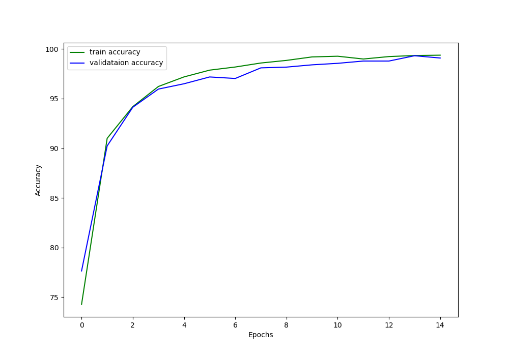
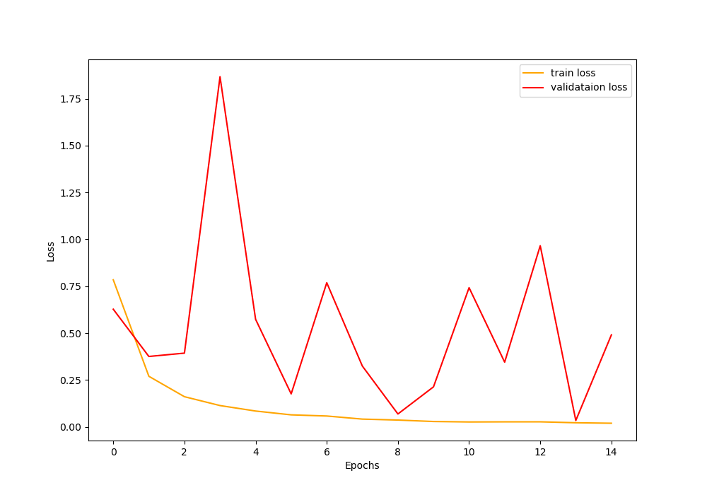
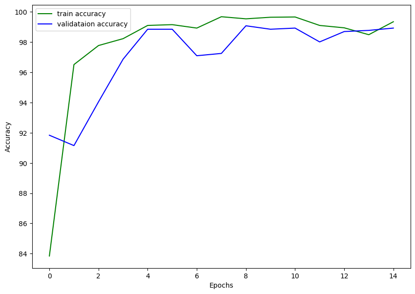
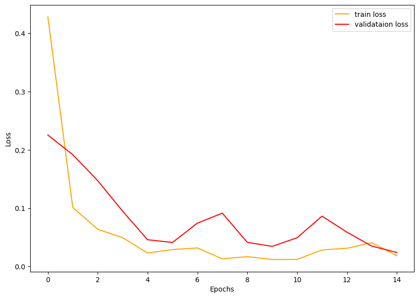

# Brain MRI Image Classification and Localization

#  Brain MRI Image Classification 
# About Dataset

For the Brain MRI Classification I use [this](https://www.kaggle.com/datasets/masoudnickparvar/brain-tumor-mri-dataset) dataset from Kaggle.

The Brain Tumor MRI Dataset is a collection of brain MRI images containing four different classes.

* glioma 
* meningioma 
* no tumor
* pituitary

Out of the four classes, glioma, meningioma, and pituitary indicate that there is a tumor present in the MRI image. While no tumor means that there is no tumor in the brain MRI image.

The dataset from Kaggle contains 5712 training images and 1311 testing images. If you take a look at the structure, then all the images are present inside their respective class directories in the Training and Testing folders. But we will change the structure a bit.

## With EfficientNetB0

 Brain MRI Classification using PyTorch EfficientNetB0. For notebook see [here](notebooks/brain-mri-classification-efficientnet.ipynb).

**Training Accuracy Log**

**Training Loss log**

For prediction, gradio is integrated, for more see [predict.py](pytorch_efficientnet/predict.py)

## ViT

Brain MRI Classification using timm `Vit : vit_base_patch32_224`. 

**Training Loss log**

